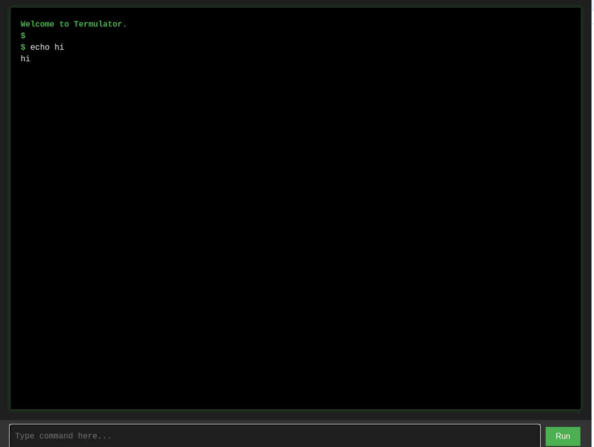

# Termulator
Zero dependency, one file Node.js browser shell

I only made this in 10 minutes (this is why the Termulator UI/UX is kinda shit) and for the purpose of having a shell for "free NodeJS hosts" (you could theoretically do this on free Minecraft servers that allow custom jars, host Termulator on the specific port and have a shell). If you're actually looking to use this as some kind of good browser shell I recommend you find some other one, this was made for easy setup purposes.

All you need to do is:

1. Download `app/index.js` from this repo (you don't need to download the app directory) and put it somewhere
2. Change config value within the file (line 3, change `//const port = 3000` to `const port = [SOME PORT HERE]`), or add a PORT env var, or don't do anything at all. Termulator will default to port 3000, if the config wasn't changed or a port env var doesn't exist.
3. Run `node index.js` and the site is running.

Licensed under CC0 1.0 Universal cus I spent 10 minutes on this for a specific case

---

(don't laugh, its minimal for a reason)

